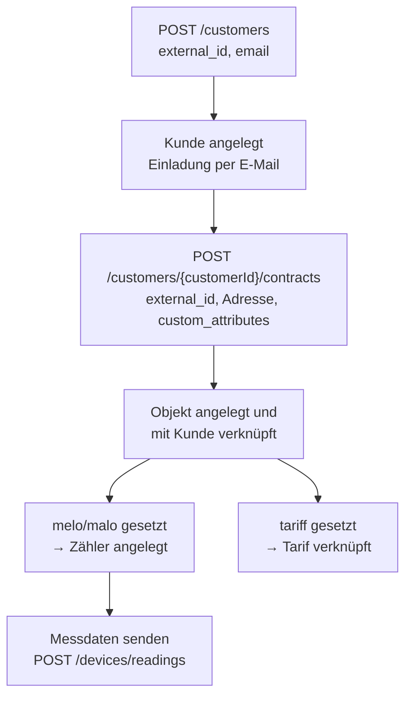

Stammdaten werden über zwei Endpunkte übertragen: `POST /customers` legt den Kunden an, `POST /customers/{customerId}/contracts` legt dessen Verträge an.

Die Idee dahinter ist ein direktes Mapping zwischen Ihrem ERP-System und unserer Plattform. Dafür geben Sie bei beiden Endpunkten eine `external_id` aus Ihrem System mit. Alle weiteren Aufrufe können Sie anschließend über diese IDs machen und müssen keine IDs aus unserem System speichern.

Beide Endpunkte sind ein Upsert: Existiert ein Datensatz mit der `external_id` bereits, wird er aktualisiert statt neu angelegt. Sie können die Endpunkte also gefahrlos wiederholt aufrufen, z. B. bei einem nächtlichen Voll-Sync.

## Ablauf



## Schritt 1: Kunde anlegen

Über `POST /customers` legen Sie einen Kunden an bzw. aktualisieren ihn.

| Feld | Beschreibung |
| --- | --- |
| `external_id` | Eindeutiger Identifier des Kunden in Ihrem System, z. B. Kundennummer, GP-Nummer oder Vertragsnummer. Dient als Schlüssel für das Upsert. |
| `email` | Optional. Wird eine E-Mail-Adresse mitgegeben, verschicken wir dem Kunden direkt eine Einladung. |
| `name` | Optional. Name des Kunden. |

<Callout type="info">
Die übrigen Felder des Endpunkts (`identifier`, Adressfelder und `custom_attributes`) sind veraltet. Adresse, Zähler und Tarif werden über den Vertrag übertragen (siehe Schritt 2).
</Callout>

```bash
curl -L 'https://external.prod.zaehlerfreunde.com/partner/customers' \
-H 'Content-Type: application/json' \
-H 'Authorization: Bearer <token>' \
-d '{
  "external_id": "K-100234",
  "email": "max.mustermann@example.com",
  "name": "Max Mustermann"
}'
```

Die Antwort enthält unsere interne ID des Kunden:

```json
{
  "customer_id": "6f6e6b9c-6d0a-4a1f-9a1e-0b1f4d2e8c11"
}
```

Sie können diese ID speichern, müssen es aber nicht: In allen folgenden Aufrufen kann als `customerId` sowohl Ihre `external_id` als auch unsere interne UUID verwendet werden.

## Schritt 2: Vertrag anlegen

Pro Kunde können beliebig viele Verträge über `POST /customers/{customerId}/contracts` angelegt werden. Als `{customerId}` verwenden Sie entweder Ihre `external_id` (z. B. `K-100234`) oder unsere interne UUID.

Beim Anlegen eines Vertrags passiert Folgendes:

1. Wir erstellen ein **Objekt** für den Vertrag und verknüpfen es mit dem Kunden.
2. Ist in den `custom_attributes` **`melo`** oder **`malo`** gesetzt, legen wir zusätzlich einen **Zähler** an. Dessen externe ID entspricht dem übergebenen melo-/malo-Wert. Über diesen Wert übertragen Sie anschließend die Messdaten (siehe [Messdaten](/integrations/api/3-meter-data)).
3. Ist in den `custom_attributes` **`tariff`** gesetzt, verknüpfen wir das Objekt mit dem entsprechenden Tarif. Der Wert muss dem internen Namen des Tarifs entsprechen, den Sie im Admin-Portal hinterlegt haben.

| Feld | Pflicht | Beschreibung |
| --- | --- | --- |
| `external_id` | ja | Eindeutiger Identifier des Vertrags in Ihrem System, z. B. die Vertragsnummer. |
| `address_line_one` | ja | Straße und Hausnummer. |
| `address_line_two` | nein | Zusätzliche Adressangaben. |
| `postcode` | ja | Postleitzahl. |
| `city` | ja | Ort. |
| `start_date` | nein | Vertragsbeginn im Format `YYYY-MM-DD`. Kunden sehen Daten erst ab diesem Tag. Bestehende Verträge auf denselben Zähler enden ab diesem Tag. |
| `medium` | nein | Sparte des Vertrags: `ELECTRICITY` (Standard), `GAS`, `WATER` oder `HEATING`. |
| `custom_attributes` | nein | Map mit Zusatzattributen. Unterstützt `melo`, `malo` und `tariff`. |

```bash
curl -L 'https://external.prod.zaehlerfreunde.com/partner/customers/K-100234/contracts' \
-H 'Content-Type: application/json' \
-H 'Authorization: Bearer <token>' \
-d '{
  "external_id": "V-2026-0815",
  "address_line_one": "Teststraße 1",
  "address_line_two": "Wohnung 3",
  "postcode": "12345",
  "city": "Musterstadt",
  "start_date": "2026-01-15",
  "medium": "ELECTRICITY",
  "custom_attributes": {
    "malo": "12345678912",
    "tariff": "basis-strom"
  }
}'
```

Die Antwort enthält unsere interne ID des Vertrags:

```json
{
  "contract_id": "1c6b1f0a-3f42-4f1a-9e2b-7d3a5c9f1e44"
}
```

## Nächster Schritt

Sobald Vertrag und Zähler angelegt sind, können Sie Messwerte über den melo-/malo-Wert als `externalDeviceId` übertragen. Details dazu finden Sie unter [Messdaten](/integrations/api/3-meter-data).