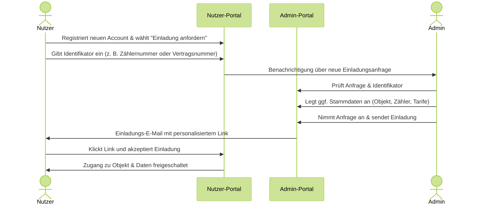

# Onboarding durch Einladungsanfrage

Es gibt verschiedene Möglichkeiten, wie neue Nutzer in Ihr Portal aufgenommen werden können. Eine davon ist der Weg über **Einladungsanfragen**: Nutzer stellen selbst eine Anfrage und geben dabei einen Identifikator an (z. B. Zählernummer oder Vertragsnummer), den Sie als Administrator prüfen und verarbeiten können. Dieser Ablauf eignet sich besonders, wenn Sie keine Einladungen manuell im Vorfeld versenden möchten, sondern den Prozess vom Nutzer initiieren lassen.

Alternativ können Einladungen auch direkt vom Administrator versendet werden – etwa über die Kundenverwaltung oder die API. Die folgende Anleitung beschreibt ausschließlich den Ablauf über Einladungsanfragen.

Ablauf des Onboardings über Einladungsanfragen

---

## Einladungsanfragen konfigurieren

Bevor Nutzer Einladungsanfragen stellen können, muss diese Funktion im Admin-Portal aktiviert und der gewünschte Identifikator festgelegt werden.

### Einladungsanfragen aktivieren

**Schritt 1:** Wechseln Sie im Admin-Portal zu **Einstellungen**.

**Schritt 2:** Aktivieren Sie zunächst die Option **„Einladung erforderlich"** . Damit wird sichergestellt, dass Nutzer nur über eine Einladung Zugang erhalten.

**Schritt 3:** Aktivieren Sie anschließend die Option **„Einladungsanfragen erlauben"**. Damit können Nutzer selbst eine Anfrage stellen, anstatt auf eine manuelle Einladung durch den Administrator warten zu müssen.

### Identifikator festlegen

Damit das System weiß, anhand welches Merkmals ein Nutzer identifiziert werden soll, muss der Identifikator einmalig definiert werden.

**Schritt 1:** Wechseln Sie im Admin-Portal zu **Kunden**.

**Schritt 2:** Öffnen Sie die Option **„Externe Kunden ID anpassen"**.

**Schritt 3:** Tragen Sie ein, welchen Identifikator Nutzer bei ihrer Anfrage angeben sollen – z. B. „Zählernummer", „Vertragsnummer" oder „Kundennummer". Diese Bezeichnung wird dem Nutzer im Anfrageformular angezeigt.

---

## Benachrichtigungen für Einladungsanfragen einrichten

Damit Ihr Team zeitnah über neue Einladungsanfragen informiert wird, können Sie festlegen, welche Mitarbeiter eine Benachrichtigung erhalten.

**Schritt 1:** Navigieren Sie in den **Einstellungen** zu **Benachrichtigungen**.

**Schritt 2:** Klicken Sie auf +, wählen Einladungsanfragen als Typ aus und tragen Sie die E-Mail-Adressen der Mitarbeiter ein, die bei einer neuen Einladungsanfrage eine Benachrichtigung erhalten sollen.

**Schritt 3:** Speichern Sie Ihre Einstellungen.

Sobald ein Nutzer eine Anfrage stellt, erhalten die hinterlegten Personen automatisch eine E-Mail mit den Angaben des Nutzers.

---

## Wie Nutzer eine Einladungsanfrage stellen

Nutzer, die noch keinen Zugang haben, können sich selbst über die Anmeldeseite des Portals registrieren und eine Einladungsanfrage einreichen.

**Schritt 1:** Der Nutzer öffnet die Anmeldeseite des Portals (z. B. `ihrunternehmen.zaehlerfreunde.de`), und wählt dort die Option **„Einladung anfordern"**.

**Schritt 2:** Der Nutzer gibt den geforderten Identifikator ein (z. B. Zählernummer oder Vertragsnummer) und klickt auf "Anfrage senden".

---

## Einladungsanfragen als Administrator bearbeiten

Sobald eine Einladungsanfrage eingeht, werden die benachrichtigten Mitarbeiter per E-Mail informiert. Die Bearbeitung erfolgt direkt im Admin-Portal.

*E-Mail Benachrichtiung welche den Admin über eine angeforderte Einldung informiert*

**Schritt 1:** Wechseln Sie im Admin-Portal zum Bereich **Einladungen** und klicken dann **Angeforderte Einladungen**.

**Schritt 2:** Sie sehen eine Übersicht aller offenen Anfragen mit der E-Mail-Adresse des Nutzers sowie dem angegebenen Identifikator (z. B. Zählernummer).

**Schritt 3:** Prüfen Sie den Identifikator und tragen Sie die passenden Stammdaten ins System ein. Finden Sie z.B. die Adresse des Kunden, erstellen das Objekt, verknüpfen es mit dem passenden Zähler.

**Schritt 4:** Beantworten Sie die Anfrage des Kunden mit einer Einladung zu dem erstellen Objekt

---

## Wie der Nutzer die Einladung erhält

Nachdem Sie die Einladungsanfrage angenommen haben, wird der Nutzer automatisch per E-Mail benachrichtigt.

**Schritt 1:** Der Nutzer erhält eine E-Mail mit einem Einladungslink.

**Schritt 2:** Der Nutzer klickt auf den Link und meldet sich mit seinem Account an.

**Schritt 3:** Der Kunde akzeptiert die Einladung und erhält sofort Zugriff auf sein Objekt und Zähler.

*Einladungs E-Mail wie Sie der Nutzer erhält. Inhalt der Einladung kann im Admin-Portal konfiguriert werden.*

